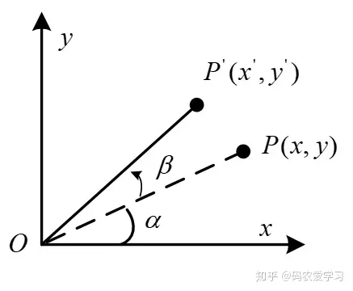
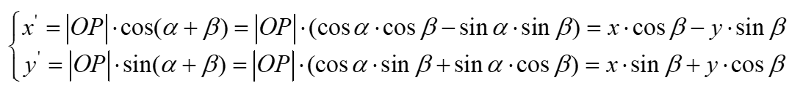
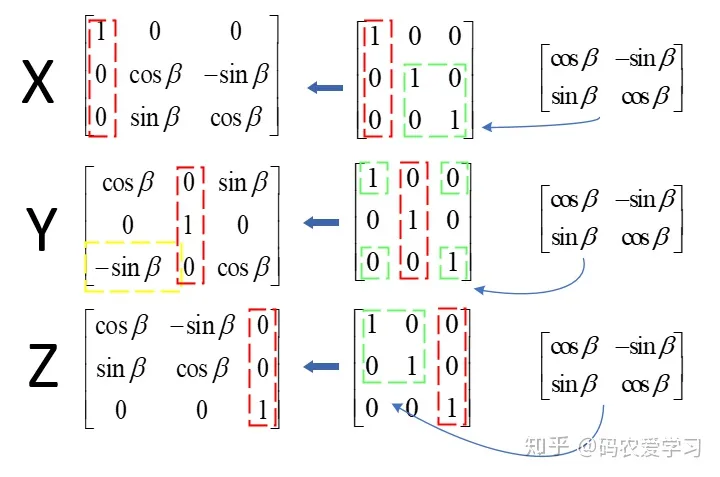
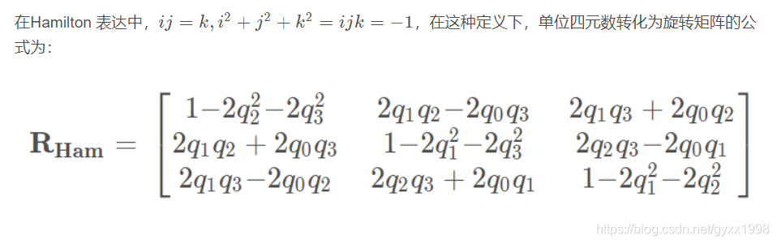

# 姿态解算任务报告


哈尔滨工程大学创梦之翼战队，电控组，张原，nicaibudaoba@qq.com

## 1、坐标系定义
### 1.1机体坐标系
载体坐标系，一个与机体绑定，随机体一同运动旋转的坐标系，以机体的质心为原点，z轴由原点指向机体顶部，y轴指向机体头部，z轴指向右机翼（成右手系）

### 1.2惯性坐标系
地理坐标系，可看作是静止不动的参照系，用于研究飞行器相对于地面的运动状态，通常以起飞位置为原点，重力加速度的方向为z轴，xy轴符合右手系即可

## 2、惯性测量单元
### 2.1陀螺仪
详细描述一下你所使用的陀螺仪的参数，以及相应的一些单片机的配置。
```c
uint8_t mpu6500_init(void)
{
	HAL_Delay(100);
 
	id = mpu_read_byte(MPU6500_WHO_AM_I);
	uint8_t i = 0;
	uint8_t MPU6500_Init_Data[10][2] =
  {{ MPU6500_PWR_MGMT_1, 0x80 },     /* 重置设备*/ 
   { MPU6500_PWR_MGMT_1, 0x03 },     /* 陀螺仪时钟源设置 */ 
   { MPU6500_PWR_MGMT_2, 0x00 },     /* 启动 Acc & Gyro */ 
   { MPU6500_CONFIG, 0x04 },         /* 低通滤波 频率20Hz */ 
   { MPU6500_GYRO_CONFIG, 0x18 },    /* +-2000dps */ 
   { MPU6500_ACCEL_CONFIG, 0x08 },   /* +-4G */ 
   { MPU6500_ACCEL_CONFIG_2, 0x02 }, /* 使能低通滤波器  设置 Acc 低通滤波 */ 
   { MPU6500_USER_CTRL, 0x20 },};    /* 使能 AUX */ 
//量程设置，二进制4，5位与手册对应
//G：0x00 = ±250dps；0x08= ±500dps 0x10	= ±1000dps 0x18	= ±2000dps 
//A：±2g (0x00), ±4g (0x08), ±8g (0x10), ±16g (0x18) 
	for (i = 0; i < 10; i++)
	{
		mpu_write_byte(MPU6500_Init_Data[i][0], MPU6500_Init_Data[i][1]);
		HAL_Delay(1);
	}
	return 0;
}
```
陀螺仪量程±2000dps
### 2.2加速度计
详细描述一下你所使用的加速度计的参数，以及相应的一些单片机的配置。<br/>
代码如上，加速度计量程±4g
### 2.3通讯协议
#### 2.3.1单片机和模块的通讯协议
使用了SPI协议，更简单，全双工性能更高，传输速率更快，在单主设备且追求性能的情况下更符合我们的需求。
#### 2.3.2单片机和模块的通讯协议
原始数据拼接后为16位有符号数，表示范围-32768～32767<br/>
若设定为4g，ax取32768时表示沿X轴正方向4倍的重力加速度。<br/>
若设定为2000度/秒，取32768时表示当前角速度为顺时针2000度/秒，以此类推。<br/>
故分别将其除32768再乘上量程即可
### 2.4 IMU零偏校准
陀螺仪校准:在静止的情况下，将多个采样的平均值作为偏置值。测量后减去这个零偏即为真实值。经过两轮850个左右数据矫正，均值误差在小数点后两位左右。<br/>
加速度计校准：设真实值=k1*ax+b1，使用matlab的lsqcurvefit函数拟合不同面的6个平均值，解出6个参数。
## 3、滤波
互补滤波算法Mahony<br/>
陀螺仪解算得到的姿态具有良好的高频特性，但是会随着时间漂移，而加速度计解算得到的姿态具有良好的低频特性，不会随着时间漂移，但是载体剧烈运动时，往往不能解算出真实的姿态。这时可以将陀螺仪的高频特性和加速度计的低频特性相融合，得到高频、低频特性都很好的算法。
```c
//填入相应的代码
```
## 4、姿态描述
### 4.1欧拉角
欧拉角一般是指在三维空间通过指定与三个旋转轴相关联的三个角度来表示任意方向的方法。<br/>
优点：直观易理解，可以通过三个角度表示物体的旋转姿态，适用于人类交互和可视化。<br/>
缺点：存在万向节死锁问题。没办法进行旋转的叠加，必须借助旋转矩阵。欧拉角共有24种，种类过多
### 4.2旋转矩阵
旋转矩阵:是在乘以一个向量的时候有改变向量的方向但不改变大小的效果并保持了手性 的矩阵。<br/>
在二维情况下：<br/>


将其写成矩阵形式并拓展到三维：<br/>

将其写四阶矩阵形式（统一格式）<br/>

还可推出绕任意轴旋转的公式
### 4.3方向余弦矩阵
#### 4.3.1方向余弦矩阵定义
大地坐标系到机体坐标系的过度矩阵
#### 4.3.2方向余弦矩阵性质
方向余弦矩阵为单位正交矩阵，每个值都是两套单位正交基的夹角余弦值
### 4.4四元数
#### 4.4.1四元数定义
四元数，是简单的超复数。 复数是由实数加上虚数单位 i 组成，其中i²= -1。 相似地，四元数都是由实数加上三个虚数单位 i、j和k 组成，而且它们有如下的关系： i² = j² = k² = -1， iº = jº = kº = 1 , 每个四元数都是 1、i、j 和 k 的线性组合，即是四元数一般可表示为a + bi+ cj + dk，其中a、b、c 、d是实数。<br/>
对于i、j和k本身的几何意义可以理解为一种旋转，其中i旋转代表Z轴与Y轴相交平面中Z轴正向向Y轴正向的旋转，j旋转代表X轴与Z轴相交平面中X轴正向向Z轴正向的旋转，k旋转代表Y轴与X轴相交平面中Y轴正向向X轴正向的旋转，-i、-j、-k分别代表i、j、k旋转的反向旋转。

#### 4.4.2四元数性质


#### 4.4.3用四元数表示旋转矩阵
已知四元数:q=q0+q1i+q2j+q3k=[s,v]


#### 4.4.4四元数微分方程


## 5、姿态解算算法
### 5.1算法原理
#### 5.1.1描述你所选用的坐标系方向
描述你所选用的坐标系方向
#### 5.1.2介绍一下你所用的算法
介绍一下你所用的算法，其各部分的原理，并将其通过代码实现出来。
### 5.2代码分析
根据你所用的算法，分析代码，在你的代码上注释出各部分的用途以及原理。
```c
//代码块1（记得删掉这行，若有多块代码，自行添加代码块）
```
### 5.3解算效果
#### 5.3.1视频演示
通过视频展现解算出的pitch，yaw，roll的效果，最好图像以及模块一同展示在画面里。
通过上传视频到gitee，并将视频添加到下方（注意，gitee的单文件有大小限制，尽量将视频压缩到50MB以下，以及总仓库大小不要超过500MB）

